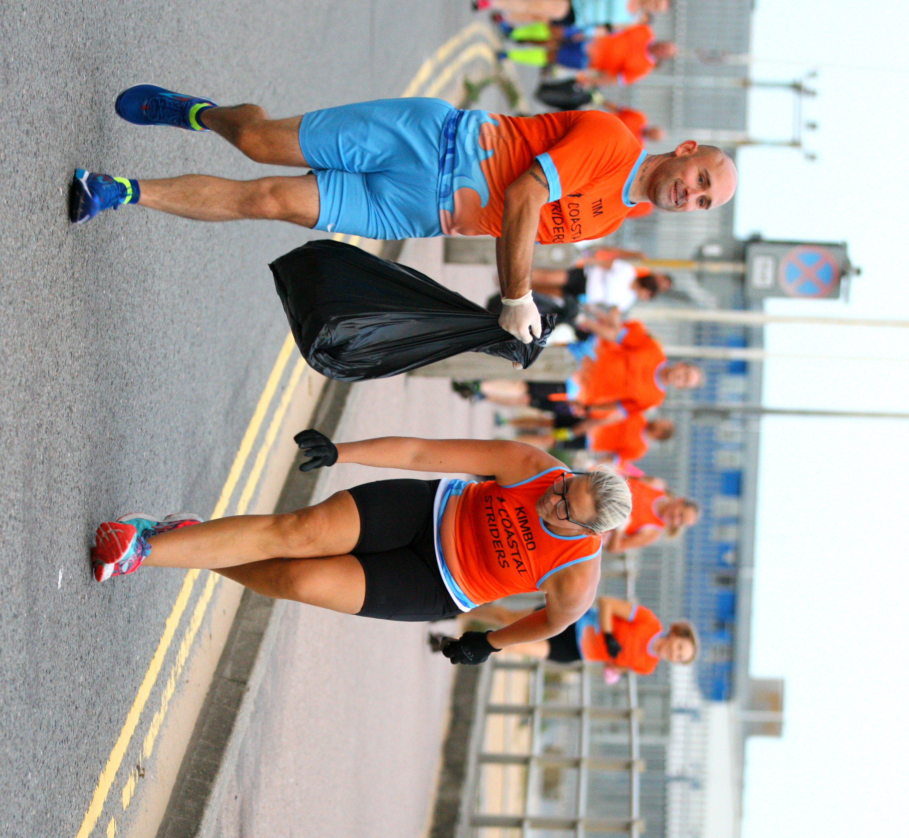
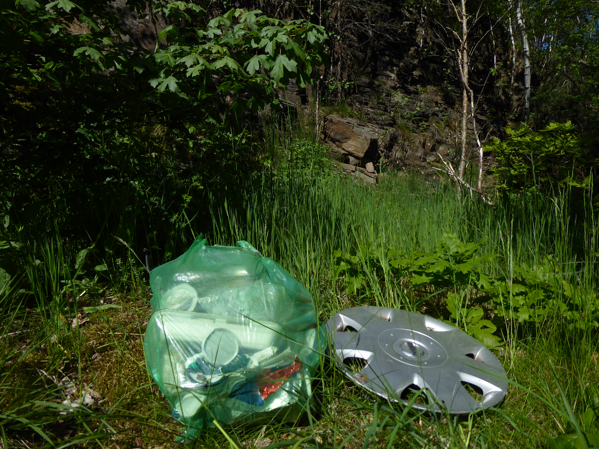
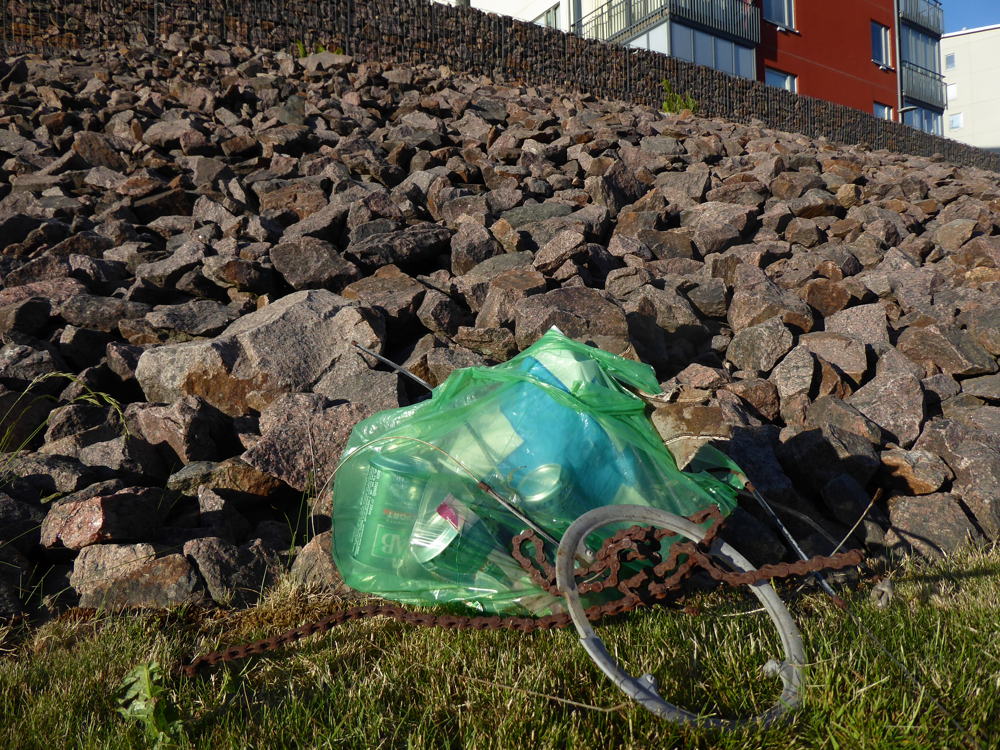

# Minnehack-2026

## what is Plogging?

JOGGING + PICKING UP LITTER AND TRASH

PLOGGING COMES FROM THE SWEDISH TERM “PLOGGA”. 
Stockholm, Sweden was the first city to host a “Plogga” in 2016. This event combined a jogging with picking up litter. "Plogga" is an activity where you picking up trash while jogging. It also reffers to running, biking, skatboarding, hiking,  or other. Plogging is a change of attitude and ploggers are proud garbage collectors who can do something for the environment and health.

Plogging is a community-driven web platform that encourages users to pick up trash while walking, running, or hiking. Where fitness and environmentalism can go hand-in-hand.

Whether you're jogging around your neighborhood or organizing a cleanup event. Plogging helps you track your impact, connect with others, and keep your community clean.

It comes from the combination of two swedish words Plocka = "pick up" and Jogga = "jog". combining Plocka and Jogga = Plogga. 

# example of joggers picking up trash

# example of trash that can be picked up from Plogging

## website design

